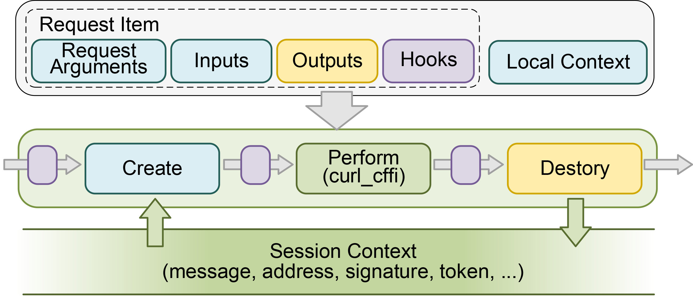

# Web3AuthChecker
Web3AuthChecker is a tool for automatically detecting vulnerabilities through dynamic analysis of Web3 websites. 


## Install
- Operating System: Windows 10/11, Ubuntu 20.04 or later
- Python Version:  3.12.3

```
pip install -r requirements.txt 
```


## Examples

Examples can be found in the folder [examples](./examples/).

### Config Files:
FlexRequest have two config files:

**Postman file**:
FlexRequest is compatible with postman files, which are used to record the API of each website, such as url, method, headers, body, etc, as shown in [./examples/postmans/0_opensea.postman_collection.json](./examples/postmans/0_opensea.postman_collection.json).

**Config file**:
The config file records the *request items* and *attack payload*, as shown in [./examples/0_opensea.io.json](./examples/0_opensea.io.json)


### FlexRequest Examples (Section 5.3 in the paper)

[./examples/1_wSession.py](./examples/1_wSession.py)

This example shows how FlexRequest can make requests based on the config files and replace parameters (attack payload) in the config files with the local context (*local_conext*).

```python
from web3_auth_checker.web_request import WebServicePostman, WebSession

ws_dir = 'examples' # the folder of the config file
ws_config_file = '0_opensea.io.json' # the config file records the request items and parameters, it also indicates the path of the postman file.

# Load the config file and postman file
wsp = WebServicePostman(ws_config_file , ws_dir)

# Create a request Session
ws = WebSession()

# keys in local_context are used to replace the parameters in the request items
local_context = {'addr':'0x36E7C6FeB20A90b07F63863D09cC12C4c9f39064','private_key': 'f78411d5886f5ded63cd304b9b56dd87b05ce0922223e87b4927cc56bfaa7b02'}

# request the API msg_query with the local_context
ws.request(wsp.get_item('msg_query'),local_context)

# request the API auth in the config file
ws.request(wsp.get_item('auth'))

# request the API settings in the config file
ws.request(wsp.get_item('settings'))

# print the response of the request
for r in ws.after_request_items:
    for k,v in r.__dict__.items():
        print(k,':',v)
```

### Web3AuthChecker Example (Section 5.2 in the paper)

Web3AuthChecker encapsulates Flexrequest, so you can use Web3Request instead of WebSession to send requests, as shown in [./examples/2_w3Request.py](./examples/2_w3Request.py).

The following example shows how to execute a Message checker.
A complete example can be found at [./examples/3_checker_examples.py](./examples/3_checker_examples.py).

```python
from web3_auth_checker.checkers import MsgChecker
from web3_auth_checker.web_request import WebServicePostman
from web3_auth_checker import logger_init
import logging

logger = logger_init(logging.ERROR)

ws_dir = 'examples' 
ws_config_file = '0_opensea.io.json'
ws_postman_dir = 'examples/postman'

# Load the config file and postman file
wsp = WebServicePostman(ws_config_file , ws_dir, ws_postman_dir)

# Load flexRequest into Message Checker.
c = MsgChecker(wsp, logger)

# Perform and save
c.check()
c.save_output()
```

### Output
The results of the checker are stored in the output folder in the format of json files. A json file records the details of the test and the vulnerabilities that exist. Table 2 in the paper summarizes this data.

Here is a result example: [Msg_security](outputs/2024-05-03/msg_security/0_opensea.io.json).
From the results, we can see that Web3AuthChecker did not find any message-related vulnerabilities in *opensea.io*.

```json
{
    "detector": "msg_security",
    ...
    "results": {
        "URL_NOT_IN_MSG": false,
        "NAME_NOT_IN_MSG": false,
        "NONCE_NOT_IN_MSG": false,
        "FAKE_MSG": false,
        "REPLACE_URL": false,
        "REPLACE_NAME": false,
        "ADD_statement": false,
    }
    ...
}

```


## Checker

Web3AuthChecker has three checkers: 
- *[Message Checker](web3_auth_checker\checkers\msg_security.py)*

- *[Nonce Checker](web3_auth_checker\checkers\nonce_security.py)*

- *[Signature Checker](web3_auth_checker\checkers\msg_sig_security.py)*

Details of these checkers can be found in the paper.
Web3AuthChecker also have a *[JSON Web Token Checker](web3_auth_checker\checkers\jwt_security.py)* to detect the vulnerabilities related to the JWT.

You can add more checkers in the folder [checkers](./web3_auth_checker/checkers/).


## FlexRequest

Given that the differences in the APIs of each website, existing testing tools or libraries, such as [Postman](https://www.postman.com/) and [Requests](https://github.com/request/request), require the development of separate test scripts for each site, leading to issues of code duplication and maintainability. 
To address these challenges, we developed a specialized HTTP library.

FlexRequest, a Python-based HTTP library, features an automatic replacement mechanism to align with the variations in APIs, providing a flexible and adaptable solution for testing APIs on various websites.
FlexRequest utilizes [cffi\_curl](https://github.com/yifeikong/curl_cffi) for HTTP requests. This Python library creates bindings for [curl-impersonate](https://github.com/lwthiker/curl-impersonate) through the C Foreign Function Interface (CFFI). *curl-impersonate* is a special build of *curl* that can impersonate the four main browsers.
By performing TLS and HTTP handshakes identical to a real browser, *curl-impersonate* ensures that websites do not block requests.

FlexRequest supports using keys to replace dynamic parameters in the API. Before executing a request, it automatically substitutes these keys with the corresponding values. After receiving the response, FlexRequest retrieves the values at the specified positions according to a predefined configuration, binding them to the corresponding keys.
By managing the values of these keys, developers can perform unified testing across multiple APIs, regardless of their differences.

Furthermore, FlexRequest maintains a *session context* throughout a session to pass the previous response values between a series of requests. For example, the message obtained from the *Query* response will be stored in the session context and bound to the key *msg*.
When conducting an *Auth* request, FlexRequest automatically populates the request with the value of *msg* from the session context.


### Challenges
To illustrate the challenges of API testing, consider the *QUERY* responses and *AUTH* requests from two different websites as shown in Listing example1 and Listing example2. In the case of galler.io, the *QUERY* returns a message directly, whereas, for element.market, the *QUERY* only returns a nonce. The *AUTH* request parameters also differ in both examples, requiring distinct test scripts for each website. This would typically lead to considerable code duplication and challenges in maintaining the codebase.

### Example1: galler.io
```
QUERY Response:
{'data':{'auth':{'message':'This is Galler, welcome...
timestamp: 1625468800000'}}}

AUTH Request:
{method:'POST', url:'https://www.galler.io/api/v1',
headers:{...}, data:{address:'{{ addr }}',
message:'{{ msg }}', signature:'{{ sig }}'}}
```

### Example2: element.market
```
QUERY Response:
{'data':{'auth':{'nonce':'3deca92b'}}}

AUTH Request:
{method:'POST', url:'https://api.element.market/graphql',
headers:{'x-viewer-addr':'{{ addr }}',...}, data:{message:
'{{ msg }}', nonce:'{{ nonce }}', signature:'{{ sig }}'}}
```

However, FlexRequest's automatic replacement mechanism harmonizes these differences. As seen in Listings example1 and example2, keys such as *addr*, *msg*, etc., are set in the *Auth* requests. By managing the values of these keys, developers can perform unified testing across multiple APIs.
For instance, to test whether a token can still be obtained with an incorrect signature, one needs to set the value of the *sig* key to be empty, which would put an empty signature in all *Auth* requests.


 

### Operation
As shown in Figure, FlexRequest operates in three phases for each request:


- **Create.** FlexRequest substitutes keys in the request with values from the *local context*, *session context*, and *inputs*.
- **Execute.** FlexRequest carries out the request using *curl\_cffi*.
- **Destory.** FlexRequest retrieves values from the specified position in the response according to *outputs*, and stores them in the *session context* in a key-value format.


A Request Item encapsulates all the pertinent details of a request, including the URL, headers, and so forth. It also includes two special parameters, *inputs* and *outputs*.
Developers can define default values (*inputs*) and return values (*outputs*) in the API's configuration file and set test values in each checker's *local context*. The local context is only valid for the current request, and those values are first filled into the request.

The key-value replacement function of FlexRequest is very powerful, and the value of a key can even be an executable expression. FlexRequest uses Python's *eval* function to evaluate expressions and return results. Therefore, developers can even simulate front-end JavaScript execution by executable expressions.
Besides, FlexRequest also provides hooks for complex API testing.


## Detail of Config file.

```json
{
    "schema": "1.0",
    "name":"", // The name of the web service
    "url":"", // The url of the web service
    "postman_file_name":"", // The postman file name
    "items":{
        "msg_query":{  // request name, MUST consist with the request name in the postman file.
            "perform":"request", // perform type: request, skip
            "input":{ // These data will be loaded into the request
                "addr": "0x1234...", // this keyword will be fill in the msg. Keywords only fill once, so cannot recurse
                "msg":"Please sign this message\n Address:$$ addr $$ Nonce is $$ nonce $$",
            },
            "output":{ // The output will be loaded into the next request
                /**
                json,path:{"kw":[]}
                state:200
                text
                html:html.text
                */
                "output":{ 
                "type":"json",
                "path":{
                    "nonce":["results","nonce"] // The nonce will be added to the session context
                }
            },
            },
            "update_request_args":{
                "impersonate": "chrome110", // set the impersonate
                "timeout": 10,
                "params":{}  // You can even update the params
            },
            "perform_conf":{} //perform config 
        },


        "auth":{
            "perform":"request", // request, input, skip
            "input":{  },
            "output":{ 
                "type":"json",
                "path":{
                    "token":["results","accessToken"] // The path of the message
                }
            },
            "update_request_args":{
                "impersonate": "chrome110", // set the impersonate
            },
            "perform_conf":{
                "sign_before_request":true
            } //perform config 
        },

        "settings":{
            "perform":"request", // request, input, skip
            "input":{  },
            "output":{ 
                "type":"state",
                "code": 200
            },
            "update_request_args":{
                "impersonate": "chrome110", // set the impersonate
            },
        },
    }
}
```

## Ethical Concerns
For ethical reasons, we will not make the API configuration files of the test websites in the experiment public.
We did not detect vulnerabilities in *opensea.io*, so use its API configuration file as an example.
